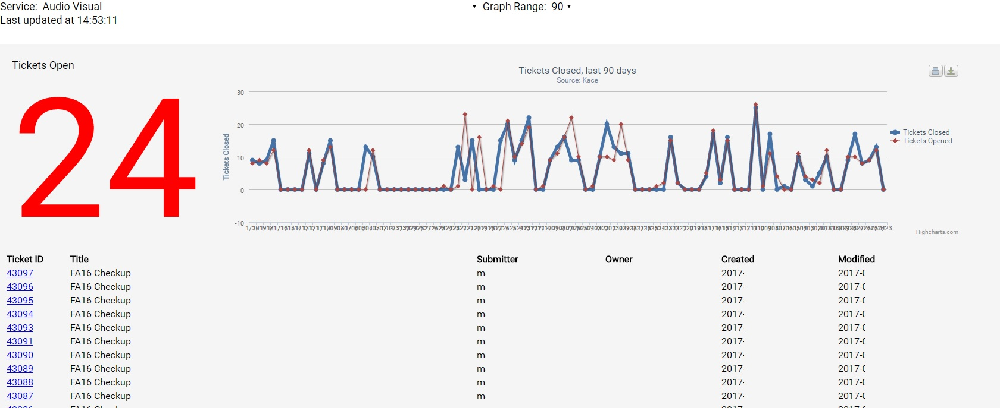

This is a simplified KACE dashboard, which allows the user to select from a number of available service providers, see the ticket list for the provider, and receive a chart showing historical ticket activity. User also can save the chart for reports or external use. Uses PHP5 and highcharts.js.

Many thanks to Jason Rappaport of Drexel University for developing the original KACE Bootstrap and for his assistance. I recommend you read about his Twitter Bootstrap for Kace Service desk on [ITNinja](http://www.itninja.com/blog/view/twitter-bootstrap-for-kace-service-desk), and consult his [KaceBootstrap](https://github.com/jasonrap/KaceBootstrap) repository before installing.

* Make sure to change $KaceBoxDNS and $dbpassword in config.php to suit your particular KACE installation.

* You also will need to find the number for the various service providers in your KACE helpdesk, and record the value (QUEUE_ID) and name of the service under the options in the selectService select box in index.php.